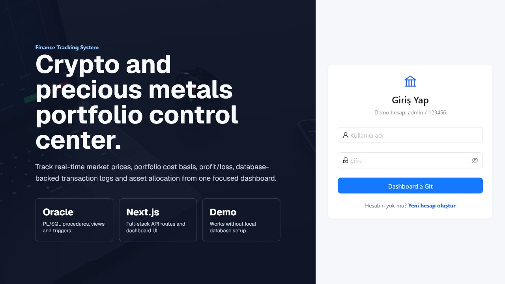
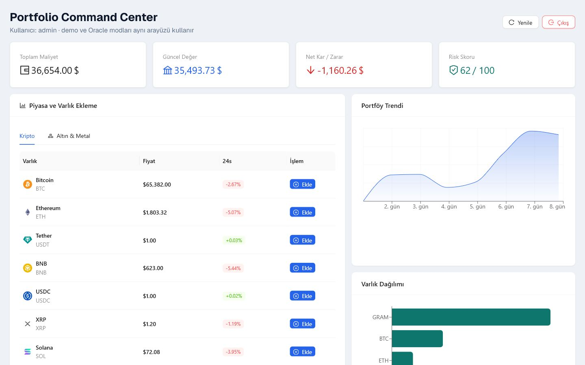

# Finance Tracking System

A full-stack portfolio management dashboard for tracking crypto and precious metals with live market data, portfolio cost basis, profit/loss analytics, and Oracle PL/SQL-backed transaction workflows.


## Screenshots

### Login



### Dashboard



## Highlights

- Professional portfolio dashboard with current value, total cost, net profit/loss and risk score
- Live crypto market data from CoinGecko with a local fallback for development
- Precious metals API route for gold, silver and certificate-like assets
- Add/sell asset workflow with modal confirmations and automatic portfolio refresh
- Asset allocation and portfolio trend visualizations with Recharts
- Oracle-ready API routes using PL/SQL procedures, views and transaction commits
- Development fallback that runs without Oracle XE for local UI review
- Environment-based database configuration with no hard-coded credentials

## Tech Stack

- Frontend: Next.js App Router, React, TypeScript, Ant Design, Recharts
- Backend: Next.js API Routes
- Database mode: Oracle XE, PL/SQL procedures, views and triggers
- Development fallback: in-memory sample users and portfolio records

## Getting Started

```bash
git clone https://github.com/noutrexx/finance-tracking-system.git
cd finance-tracking-system
npm install
cp .env.example .env.local
npm run dev
```

Open `http://localhost:3000` and sign in with a locally configured account.

## Oracle Configuration

Create `.env.local` from `.env.example` and fill in your local Oracle XE values:

```env
ORACLE_USER=system
ORACLE_PASSWORD=your_password
ORACLE_CONNECT_STRING=localhost:1521/xe
NEXT_PUBLIC_DEMO_MODE=true
```

Leave `NEXT_PUBLIC_DEMO_MODE=true` when reviewing the UI without Oracle XE. Switch it to `false` after configuring the local database objects below.

Expected database objects:

- `KULLANICILAR`
- `VW_KULLANICI_PORTFOYU`
- `VW_SISTEM_OZETI`
- `SP_COIN_EKLE`
- `SP_COIN_SAT`
- transaction logging trigger table/workflow

## Validation

```bash
npm run lint
npm run build
```

Both commands are expected to pass before publishing changes.

## Project Scope

This project was built as a database systems and full-stack engineering portfolio project. The main engineering focus is the boundary between a polished web dashboard and database-side business logic such as procedures, views, commits and transaction logs.
