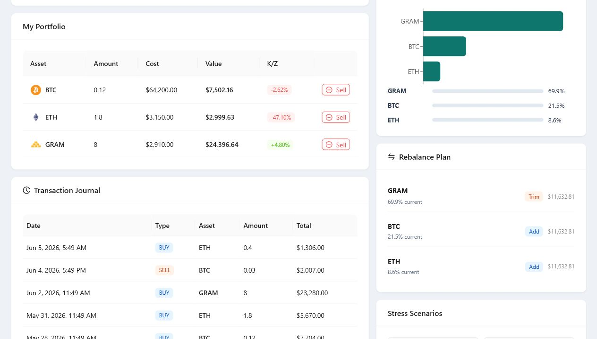

# Finance Tracking System

Professional full-stack portfolio command center for tracking crypto and precious metals with live market data, portfolio cost basis, profit/loss analytics, risk monitoring, rebalancing guidance, transaction history, and Oracle PL/SQL-ready workflows.


## Screenshots

### Login


### Portfolio Command Center


### Operations and Risk Views



## Highlights

- Live crypto market watchlist from CoinGecko with local fallback prices.
- Precious metals watchlist for gram gold, gold ounce, certificate-like assets, and silver.
- Buy and sell workflows with modal confirmations and automatic portfolio refresh.
- Portfolio cost basis, current value, net profit/loss, return percentage, and risk score.
- Asset allocation chart, concentration analysis, risk radar, and drawdown buffer.
- Rebalancing plan that flags assets to add, trim, or hold based on equal-weight targets.
- Stress scenarios for quick -15%, -7%, +7%, and +15% portfolio impact checks.
- Transaction journal with buy/sell history and demo transaction persistence.
- Searchable market watchlist and one-click CSV export for holdings.
- Oracle-ready API boundary using procedures, views, commits, and transaction-style workflows.
- Demo mode that runs without Oracle XE for portfolio review and screenshots.

## Tech Stack

| Layer | Tools |
| --- | --- |
| Frontend | Next.js App Router, React, TypeScript, Ant Design |
| Analytics | Recharts, allocation charts, portfolio trend, risk calculations |
| Backend | Next.js API Routes |
| Database Mode | Oracle XE, PL/SQL procedures, views, transaction commits |
| Demo Mode | In-memory sample users, holdings, transaction journal, and market fallbacks |

## Getting Started

```bash
git clone https://github.com/noutrexx/finance-tracking-system.git
cd finance-tracking-system
npm install
cp .env.example .env.local
npm run dev
```

Open `http://localhost:3000`.

Demo credentials:

```txt
username: admin
password: 123456
```

## Environment

Create `.env.local` from `.env.example` and fill in your local Oracle XE values:

```env
ORACLE_USER=system
ORACLE_PASSWORD=your_password
ORACLE_CONNECT_STRING=localhost:1521/xe
NEXT_PUBLIC_DEMO_MODE=true
```

Leave `NEXT_PUBLIC_DEMO_MODE=true` when reviewing the UI without Oracle XE. Switch it to `false` after configuring the local database objects below.

Expected database objects:

- `KULLANICILAR`
- `VW_KULLANICI_PORTFOYU`
- `VW_SISTEM_OZETI`
- `VW_KULLANICI_ISLEM_GECMISI`
- `SP_COIN_EKLE`
- `SP_COIN_SAT`
- transaction logging trigger table/workflow

## API Surface

| Route | Purpose |
| --- | --- |
| `POST /api/login` | Validate user credentials. |
| `POST /api/register` | Create a local/demo user account. |
| `POST /api/portfolio/list` | Load user holdings. |
| `POST /api/portfolio/add` | Buy or average into an asset. |
| `POST /api/portfolio/delete` | Sell part or all of a holding. |
| `POST /api/transactions` | Load buy/sell journal rows. |
| `GET /api/stats` | Load system/user/log counts. |
| `GET /api/market/gold` | Load precious metals fallback market data. |

## Validation

```bash
npm run lint
npm run build
```

Both commands are expected to pass before publishing changes.

## Project Scope

This project was built as a database systems and full-stack engineering portfolio project. The main engineering focus is the boundary between a polished portfolio operations dashboard and database-side business logic such as procedures, views, commits, transaction logs, and Oracle-ready workflows.
